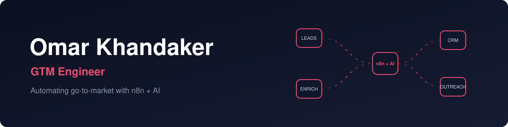
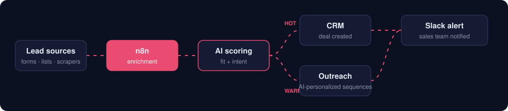

  

  
  

---

### ⚙️ What I build

I design the systems that fill a sales pipeline without anyone lifting a finger: leads come in, get enriched and scored by AI, land in the CRM, and outreach goes out automatically.

### 🤝 What I can help with

<table>
  <tr>
    <td width="33%" valign="top">
      <h4>📤 Outbound automation</h4>
      Lead sourcing, enrichment and multi-step outreach sequences that run themselves.
    </td>
    <td width="33%" valign="top">
      <h4>🤖 AI agents</h4>
      Agents that research prospects, qualify leads and write personalized messages.
    </td>
    <td width="33%" valign="top">
      <h4>🗂️ CRM & data ops</h4>
      Clean pipelines, syncs between tools, dedupe and reporting, all wired together with n8n.
    </td>
  </tr>
</table>

### 🛠️ Toolbox

  
  
  
  
  
  

<!--
### 🚀 Featured workflows
Add 2-3 pinned repos here once published, e.g.:
- **[lead-enrichment-pipeline](https://github.com/omark-dev/lead-enrichment-pipeline)** : what it does, result it gets
-->

### 🐍 Activity

<picture>
  <source media="(prefers-color-scheme: dark)" srcset="https://raw.githubusercontent.com/omark-dev/omark-dev/output/snake-dark.svg"/>
  
</picture>

---

  <b>Want your go-to-market on autopilot?</b>  
  

